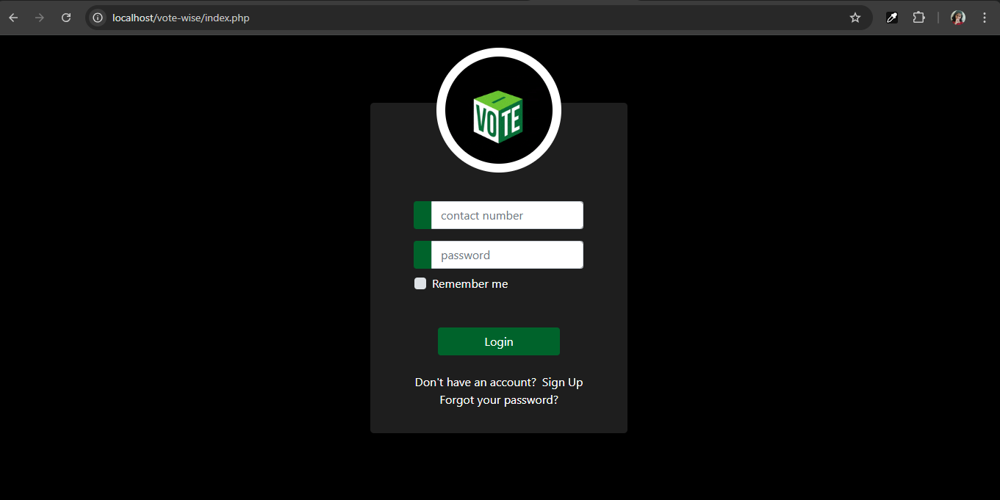
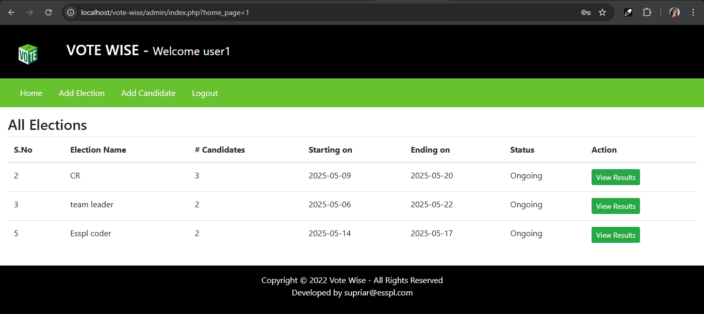
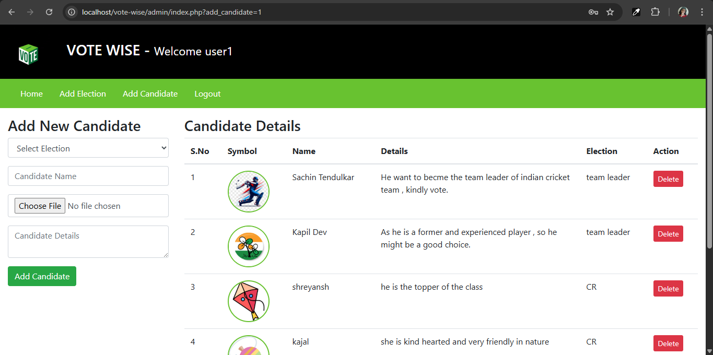
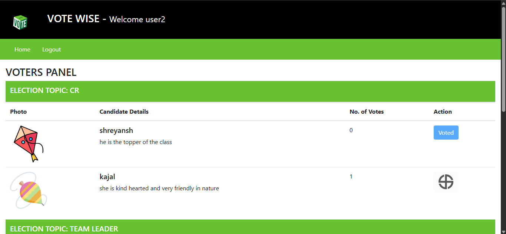

# 🗳️ VOTE-WISE

A simple and secure **Online Voting System** built with **PHP**, **MySQL**, **HTML**, **Bootstrap**, and **jQuery**.

This project allows two types of users:

- **Admin**: Manages elections and candidates.
- **Voter**: Casts a vote (only once) in ongoing elections.

---

## 📌 Features

### 👩‍💼 Admin Panel

- Add, view, and delete **elections**
- Add, view, and delete **candidates**
- View **voting results**
- Elections are categorized as:
  - ✅ Ongoing
  - 🕓 Upcoming
  - ❌ Completed

### 🧑‍💻 Voter Panel

- View ongoing elections
- Cast a vote to **only one candidate per election**
- Once voted:
  - All voting buttons are disabled for that election
  - Duplicate voting is strictly prevented

---

## 💻 Tech Stack

| Technology     | Purpose                           |
| -------------- | --------------------------------- |
| **HTML**       | Structure of web pages            |
| **Bootstrap**  | Responsive UI components          |
| **jQuery**     | Easy DOM manipulation and AJAX    |
| **PHP (Core)** | Backend logic                     |
| **MySQL**      | Database management               |
| **AJAX**       | Smooth voting without page reload |

---

## ⚙️ How to Run the Project Locally

1. **Download and install [XAMPP](https://www.apachefriends.org/index.html)**.
2. Clone or download this repository and place it in the `htdocs` folder of XAMPP.
3. Open **XAMPP Control Panel**, start **Apache** and **MySQL**.
4. Open `http://localhost/phpmyadmin` and import the provided SQL file (`database.sql`).
5. Go to `http://localhost/vote-wise` to access the project.
6. Login as Admin or Voter using sample credentials or register as a voter.

---

## 🛡️ Security Features

- Session-based login system
- Voter can vote only once per election (checked in both frontend and backend)
- Database-level constraints to prevent multiple votes

---

## 📸 Screenshots

### 🔐 Login Page

### 🛠️ Admin Panel

### 🗳️ Candidate Page

### 📊 Voter Panel

---

## 🙋‍♀️ Created By

- [@supriyarani-dhal](https://github.com/supriyarani-dhal)

---

## 📜 License

This project is open-source and free to use for learning and educational purposes.
